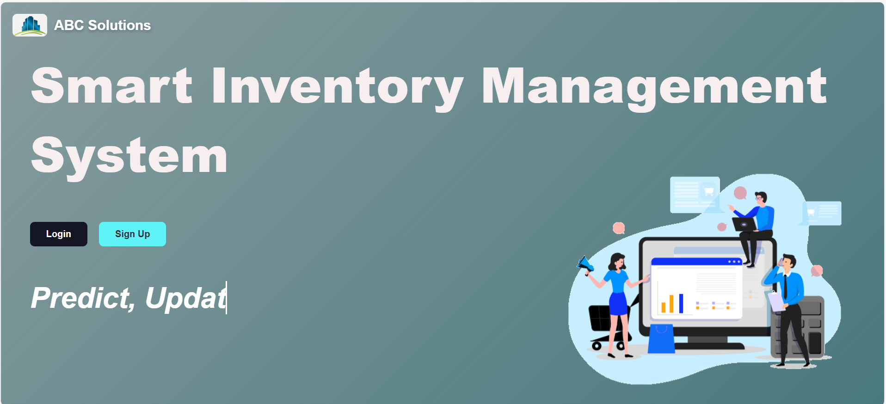

# Inventory-Management-system

## Overview
This project is an **Inventory Management System** developed using **Python** and **Flask**.  
It allows users to manage product inventory, track stock levels, and perform automated tasks like email notifications and scheduled updates.

The project also demonstrates **data processing and machine learning**, including predictive features for inventory trends.

---

## Features
- Web-based interface using **Flask**  
- Manage product inventory (add, update, delete)  
- View inventory in tables with sorting and search  
- Automated tasks using **schedule** library (e.g., monthly stock alerts)  
- Send email notifications using **yagmail**  
- Data processing and analysis using **pandas** and **NumPy**  
- Machine Learning features with **scikit-learn** and **joblib**  

---

## Project Setup

### 1. Clone the repository
\`\`\`bash
git clone https://github.com/Thavisha72/Inventory-Management-System.git
cd Inventory-Management-System
\`\`\`

### Extract datasets.zip and take out both sales and inventry datasets to the project folder

### 2. Create and activate a virtual environment
\`\`\`powershell
python -m venv .venv
.\.venv\Scripts\Activate.ps1
\`\`\`

### 3. Install dependencies
\`\`\`powershell
pip install -r requirements.txt
\`\`\`

### 4. Add / place the trained ML model
- The file `Stock_prediction_model.pkl` is required to run the predictive features.  
- Place `Stock_prediction_model.pkl` in the project root folder (same level as `app.py`).  
- If `Stock_Prediction_model.pkl` is not included, you can generate it by running `train_model.py` (training script included).

### 5. Run the application
\`\`\`powershell
python app.py
\`\`\`
Open your browser at [http://127.0.0.1:5000](http://127.0.0.1:5000)

---

## Dependencies
All required libraries are listed in `requirements.txt`, including:
- Flask
- pandas, numpy
- scikit-learn, joblib
- schedule
- yagmail, keyring
- python-dotenv
- Werkzeug, Jinja2, click, itsdangerous (Flask sub-dependencies)

---

## Contributors
- **Thavisha Nipun Bandara** – Data Science Undergraduate, SLTC (thavishanipun@gmail.com)
- **Rawishka Dilshan** –  Cyber security Undergraduate, SLTC 
- **Devhan Dharmarathne** – Cyber security Undergraduate, SLTC 
- **Sandeepa Dilshan** – Cyber security Undergraduate, SLTC  
- **Muthuni Nimshi** – Data Science Undergraduate, SLTC

